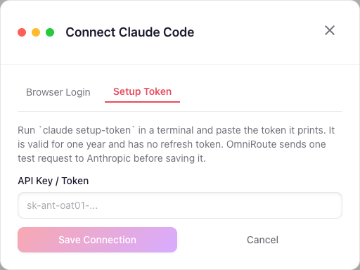

# Claude Code with a `claude setup-token` token

`claude setup-token` prints a long-lived OAuth token (`sk-ant-oat01-…`) for a Claude Pro/Max
subscription. It is valid for one year and needs no browser session, which makes it the simplest
way to connect a headless or containerized OmniRoute to the **Claude Code** provider (`cc/`).

## Connect it

1. On any machine with Claude Code installed and logged in, run `claude setup-token` and copy the
   token it prints.
2. Dashboard → Providers → **Claude Code** → **Add Connection**. The dialog opens on the
   **Setup Token** tab; nothing is sent to claude.ai unless you switch to **Browser Login**.
3. Paste the token and save. The connection is named "Setup token"; rename it if you add several.



Before anything is stored, OmniRoute sends one `max_tokens: 1` request to Anthropic with the token.
A token that does not start with `sk-ant-oat`, or that Anthropic rejects, is refused with a 400
and no connection is created.

The same import is available over the API (management auth required):

```bash
curl -X POST http://localhost:20128/api/oauth/claude/import-token \
  -H "Content-Type: application/json" \
  -b "auth_token=<dashboard session cookie>" \
  -d '{"token":"sk-ant-oat01-..."}'
```

Pass `"connectionId": "<id>"` to replace the token of an existing Claude Code connection, for
example when the year is up. Pasting a token that is already stored updates that connection
instead of adding a second one.

## How it differs from Browser Login

|                             | Browser Login                 | Setup token                            |
| --------------------------- | ----------------------------- | -------------------------------------- |
| Lifetime                    | short access token, refreshed | one year, no refresh token             |
| Account email on the row    | yes                           | no (the token cannot read the profile) |
| Chat / Messages / streaming | yes                           | yes                                    |
| Quota bars (5h / weekly)    | yes                           | no                                     |

The token carries the `user:inference` scope only. Anthropic answers `403
oauth_scope_insufficient` to the profile, bootstrap and usage endpoints, so the connection has no
email and the quota view shows a notice instead of the 5-hour and weekly bars. Requests are
unaffected.

The health check does not mark a setup-token connection expired just because it has no refresh
token (#14261). There is nothing to refresh, so when the token is revoked or reaches its year,
requests on that connection fail with Anthropic's 401. Run `claude setup-token` again and paste the
new token into the same connection (Reconnect → **Setup Token**).
